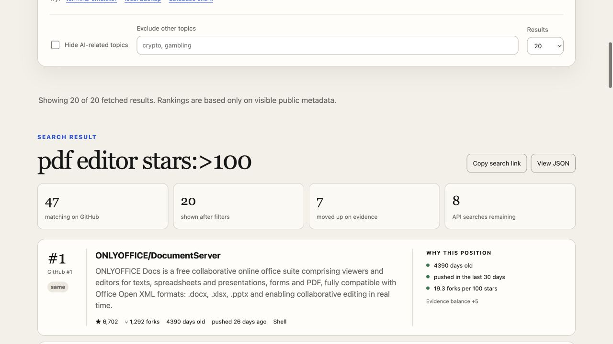

# GitHub for Humans

Search GitHub by visible maintenance evidence, not raw star count.

This is an early read-only MVP. It runs a normal public GitHub repository search,
optionally removes unwanted topics, then compares GitHub's star-sorted position
with an evidence position. Every movement is explained.



## Quick start

Requires Node.js 18 or newer. There are no package dependencies.

```sh
git clone https://github.com/howong217-ui/github-for-humans.git
cd github-for-humans
npm start
```

Open <http://127.0.0.1:4173>, enter the kind of repository you need, and inspect
why each result moved up or down. Stop the server with `Ctrl-C`.

## What it does

- Searches live public repositories through the GitHub Search API.
- Preserves each repository's original GitHub position.
- Re-ranks results using repository age, recent pushes, fork behavior, and star
  velocity context.
- Supports an optional AI-topic preset and arbitrary user blocklist terms.
- Shows rank movement and the rule behind every score adjustment.
- Exposes the same result as a web interface, JSON API, and CLI report.

The evidence balance is not a fraud, authorship, security, or quality verdict.
High growth can be legitimate and low forks can be normal. Account type is
intentionally excluded because an organization is not an identity guarantee.

## Optional GitHub token

Public unauthenticated GitHub search is rate limited. A local token is optional:

```sh
GITHUB_TOKEN=your_token npm start
```

The token remains in the local server process and is never returned to the
browser.

## JSON API

```text
GET /api/search?q=pdf+editor+stars%3A%3E100&exclude_ai=1&exclude_topics=crypto&per_page=30
GET /api/health
```

The search response contains:

- `originalRank`: position in GitHub's star-sorted response.
- `evidenceRank`: position after visible evidence rules.
- `rankDelta`: positive values mean the project moved up.
- `evidence`: every rule that affected the score.
- `signals`: raw calculated values used by the rules.
- GitHub result count, incomplete-result state, and rate-limit metadata.

## CLI

Search GitHub live:

```sh
node src/cli.mjs --query "pdf editor stars:>100" --exclude-ai --limit 30
```

Rank an existing GitHub Search API response deterministically:

```sh
node src/cli.mjs search.json \
  --exclude-topics crypto,gambling \
  --as-of 2026-07-12T00:00:00Z \
  --html report.html
```

## Verify

```sh
npm test
npm run demo
```

The automated suite covers ranking, filters, deterministic reports, GitHub API
requests and failures, the local server, static UI delivery, and JSON search.

## License

MIT

## Current limits

- The MVP uses only fields available from repository search. It does not yet
  inspect release continuity, contributor history, package downloads, or issue
  participation.
- Keyword topic filters are transparent but imperfect and user-configurable.
- GitHub relevance determines which repositories enter the candidate set; this
  project only re-ranks that set.
- An unauthenticated local session has a small GitHub Search API allowance.
